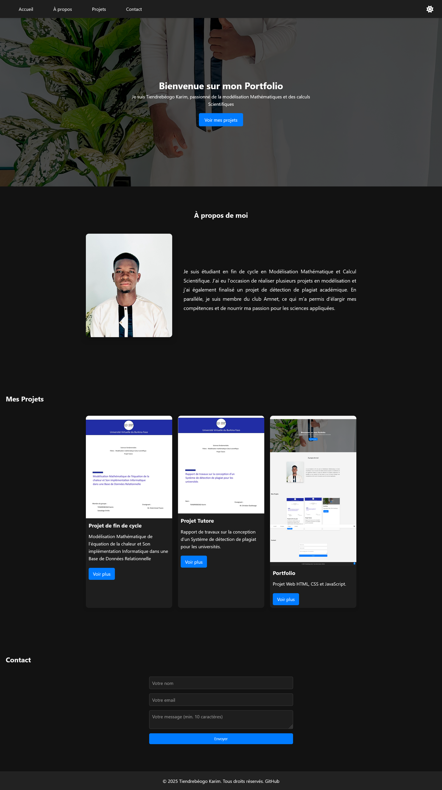

# Projet Web HTML, CSS et JavaScript  

Ce projet est une mini-page web complète et responsive, réalisée dans le cadre du cours de développement web.  
L’objectif est de mettre en pratique les notions de **HTML5, CSS3 et JavaScript** pour créer un site esthétique, interactif et bien structuré.  

## 🎯 Fonctionnalités  

- **Bannière (Hero)** avec image de fond et texte d’accroche.  
- **Menu de navigation** avec boutons stylisés (hover/focus visibles).  
- **Section "À propos"** avec texte descriptif et image.  
- **Section "Projets/Articles"** : au moins 3 cartes (titre, image, description, lien).  
- **Section "Contact"** : formulaire avec validation (nom, email, message).  
- **Interactions JavaScript** :  
  - Validation du formulaire.  
  - Changement de thème clair/sombre.  
  - Message de confirmation après envoi.  
  - Petit composant dynamique supplémentaire (*exemple : bouton retour en haut*).  
- **Footer** avec informations personnelles et droits d’auteur.  

## Technologies utilisées  

- **HTML5** : structure sémantique.  
- **CSS3** : design, Flexbox/Grid, responsive design, hover/focus, ombres, bordures arrondies.  
- **JavaScript** : gestion des événements, manipulation du DOM, validation formulaire, interactions dynamiques. 


## Arborescence du projet  

projet-web-html-css-js/
```
├── index.html
├── style.css
├── script.js
└── images/
```

## Lancer le projet  

  Lien GitHub Pages : [Voir le projet en ligne](https://karimtiendrebeogo.github.io/projet-web-html-css-js)


## Capture d'écran  

1. Page mode clair :  


2. Page mode sombre :  



## Auteur
TIENDREBEOGO, Karim, Licence 3 en Modélisation Mathématiques.